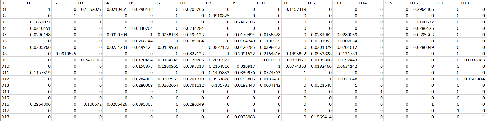

### Requisitos

Tener instalado Python 3.7 (o superiores), si se utiliza windows, entonces la versión de Python instalada debe ser para 32 bits.

### Proceso de instalación

<ol>
    <li>
Descargar los archivos de esta carpeta.
    
</li>
    <li>
Instalar las librerías de python <strong>"nltk"</strong>, <strong>"random"</strong>, <strong>"json"</strong> y <strong>"unicodedata"</strong>.
    
</li>
    <li>
Instalar las librerías NLTK adicionales, a través de las sentencias:
        <ul>
            <li>
nltk.download(<strong>'punkt'</strong>)
            
</li>
            <li>
nltk.download(<strong>'stopwords'</strong>)
            
</li>
        </ul>
    
</li>
    <li>
Ejecutar archivo <strong>"matriz.py"</strong> de la siguiente forma:
        <ul>
            <li>
"terminal&gt; Python nombreDelArchivo.py"
            
</li>
            <li>
"terminal&gt; Python3 nombreDelArchivo.py"
            
</li>
        </ul>
    
</li>
</ol>

### Descripción y resultado

Este ejercicio generara un archivo <strong>"matriz-coseno.csv"</strong>, como se muestra en la siguiente imagen, que tiene una matriz-coseno resultante de analizar el archivo <strong>"documentos.txt"</strong>. Esto, a través de la ejecución del archivo <strong>"matriz.py"</strong>. 

 

*******
## Créditos

Autor: *Jorge Luis Jácome Domínguez*

######  Otros medios < [Linkedin](https://www.linkedin.com/in/jorge-luis-j%C3%A1come-dom%C3%ADnguez-44294a91/) - [Dibujando](https://dibujando.net/soragefroren) - [Facebook](https://www.facebook.com/SoraGefroren) - [Youtube](https://www.youtube.com/c/SoraGefroren) >

