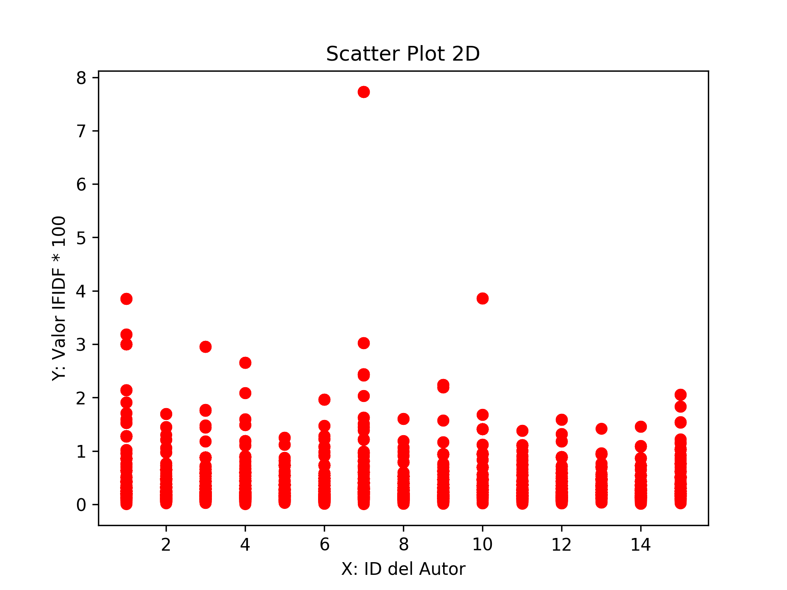
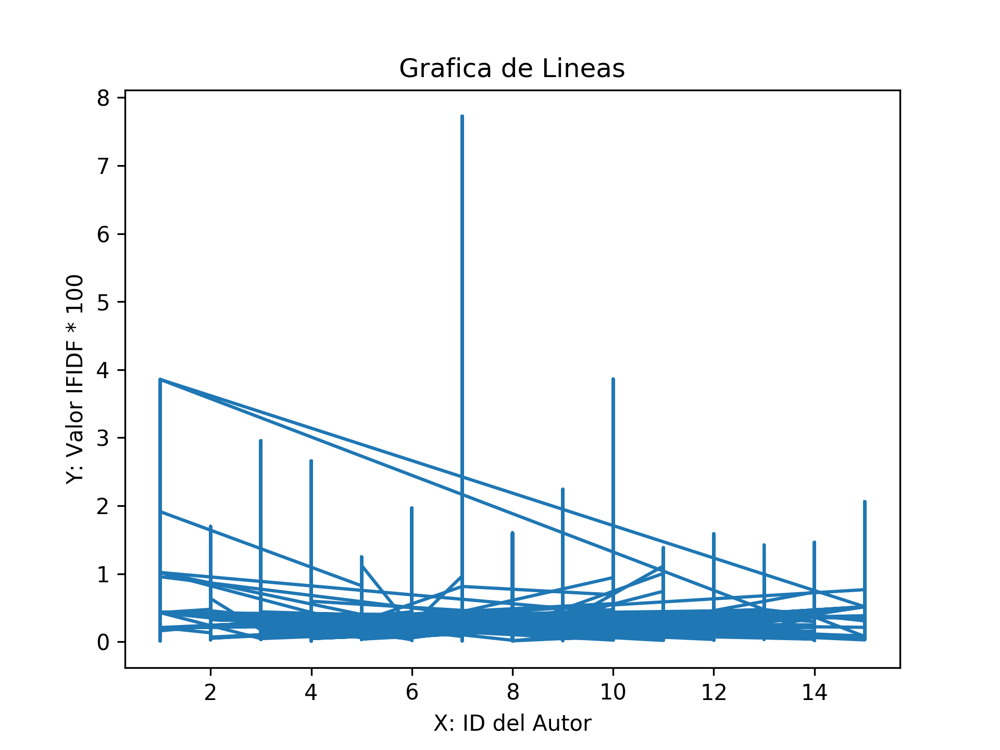
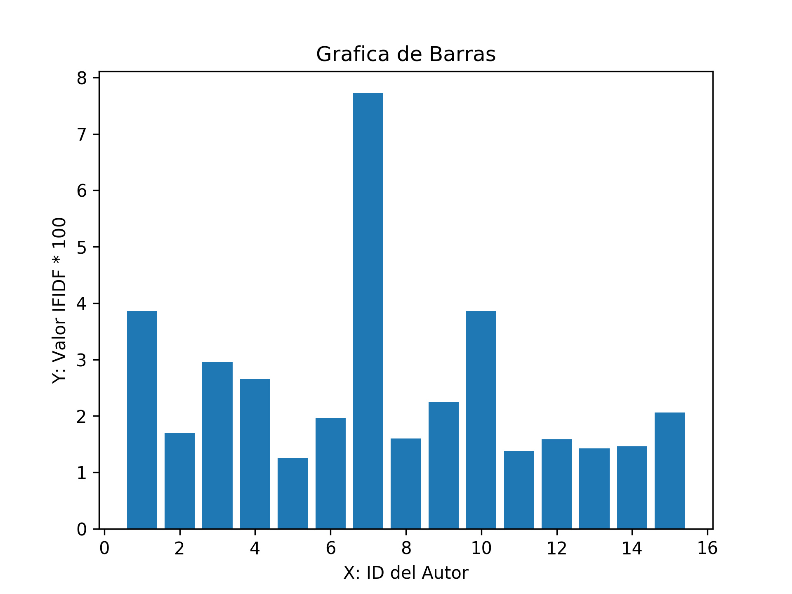
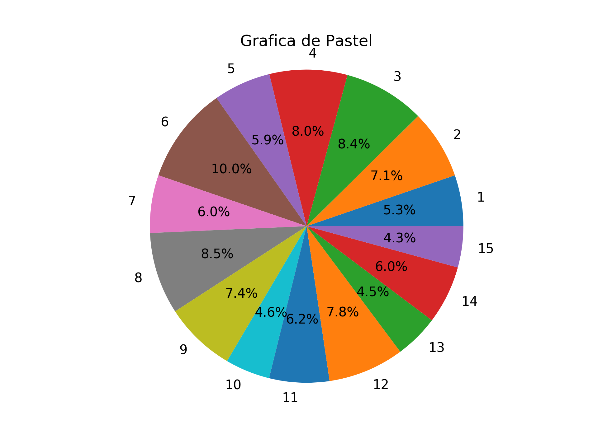

### Requisitos

Tener instalado Python 3.7 (o superiores), si se utiliza windows, entonces la versión de Python instalada debe ser para 32 bits.

### Proceso de instalación

<ol>
    <li>
Descargar los archivos de esta carpeta.
    
</li>
    <li>
Instalar las librerías de python <strong>"numpy"</strong>, <strong>"pandas"</strong>, <strong>"sklearn"</strong>, <strong>"nltk"</strong>, <strong>"random"</strong>, <strong>"json"</strong>, <strong>"seaborn"</strong> y <strong>"unicodedata"</strong>.
    
</li>
    <li>
Instalar las librerías NLTK adicionales, a través de las sentencias:
        <ul>
            <li>
nltk.download(<strong>'punkt'</strong>)
            
</li>
            <li>
nltk.download(<strong>'stopwords'</strong>)
            
</li>
        </ul>
    
</li>
    <li>
Ejecutar archivo <strong>"v1_principal.py"</strong> y <strong>"v2_principal.py"</strong> de la siguiente forma:
        <ul>
            <li>
"terminal&gt; Python nombreDelArchivo.py"
            
</li>
            <li>
"terminal&gt; Python3 nombreDelArchivo.py"
            
</li>
        </ul>
    
</li>
</ol>

### Descripción

En este ejercicio se calculó la precisión un modelo de clasificación aplicado al documento <strong>"/docs/author_corpus_all.txt"</strong>, para lo cual, se ejecutó el archivo <strong>"v1_principal.py"</strong>. También, se utilizó una clasificación se basada en el cálculo de <strong>ITIDF</strong> de toda palabra (que no sea funcional o simbólica en el documento), multiplicado por cien. Obteniendo así, los siguientes resultados:

 

<ul>
    <li>
BaseLine: <strong>0.0838095238095238</strong>
    
</li>
    <li>
Con Regresión Logística, la precisión fue de: <strong>0.8857142857142857</strong>
    
</li>
    <li>
Con K Vecinos más cercanos, la precisión fue de: <strong>0.6209523809523809</strong>
    
</li>
    <li>
Con Maquina de Soporte Vectorial, la precisión fue de: <strong>0.8590476190476191</strong>
    
</li>
</ul>

### ¿Las características seleccionadas, son buenas o no para el entrenamiento?

Finalmente, se analizaron las características seleccionadas con base en cada autor de los párrafos o datos analizados, ejecutando el archivo <strong>"v2_principal.py"</strong> y obteniendo las siguientes gráficas:

Sin embargo, de acuerdo a los resultados obtenidos se puede decir que las características seleccionadas y analizadas en el texto, no resultan convincentes, por tanto, no se consideran buenos para el entrenamiento, esto a pesar de la precisión obtenida. Frente lo cual, cabe decir que antes de crear las gráficas, fue necesario formatear los datos y retirar los valores <strong>IFIDF</strong> iguales a cero, ya que este valor abundaba en los datos y opacaba seriamente al resto. Aun así, bajo esta estrategia se identificaron valores atípicos, por ejemplo, en el ScatterPlot, se encontró que el autor siete y diez muestran palabras con un valor <strong>IFIDF</strong> alto, en comparación a los otros datos. Mientras que, visualmente, con el grafico de pastel se pudo observar que el número de palabras por autor es porcentualmente similar, no alejándose más de un 6% una de otras. Aunque, lamentablemente el grafico de líneas no apoya al análisis de los datos, como fue el caso del grafico de barras.

*******
## Créditos

Autor: *Jorge Luis Jácome Domínguez*

######  Otros medios < [Linkedin](https://www.linkedin.com/in/jorge-luis-j%C3%A1come-dom%C3%ADnguez-44294a91/) - [Dibujando](https://dibujando.net/soragefroren) - [Facebook](https://www.facebook.com/SoraGefroren) - [Youtube](https://www.youtube.com/c/SoraGefroren) >

