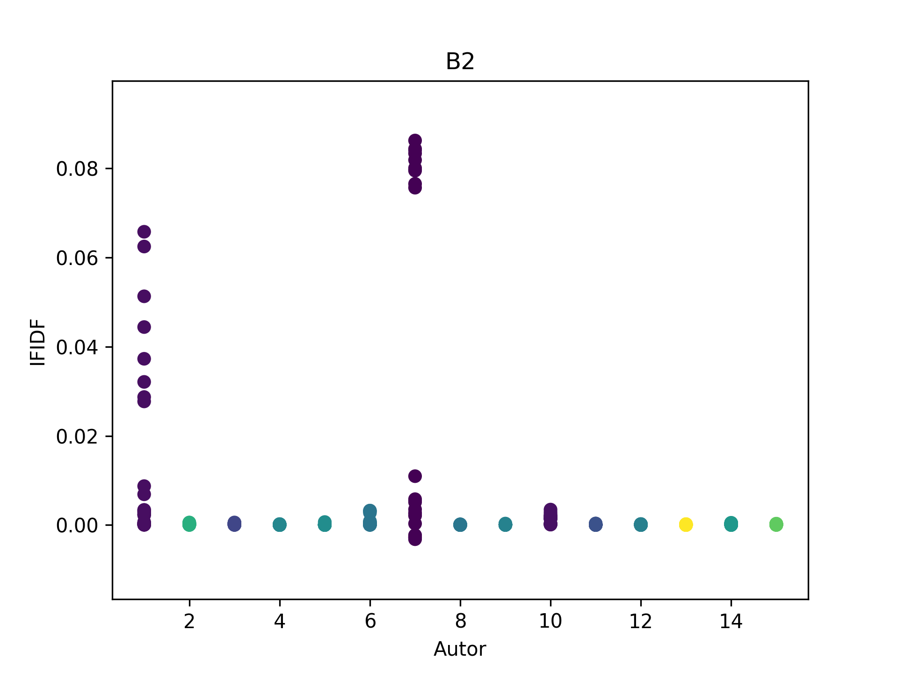
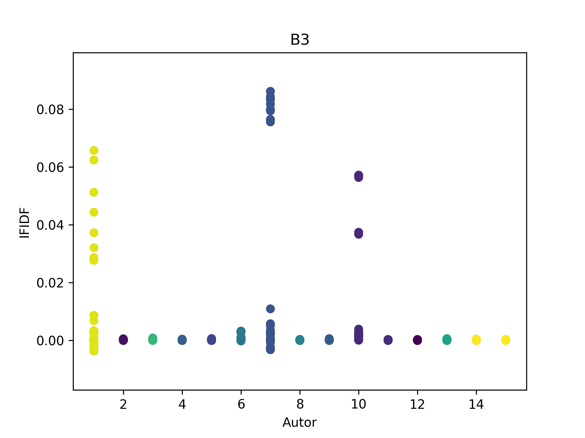
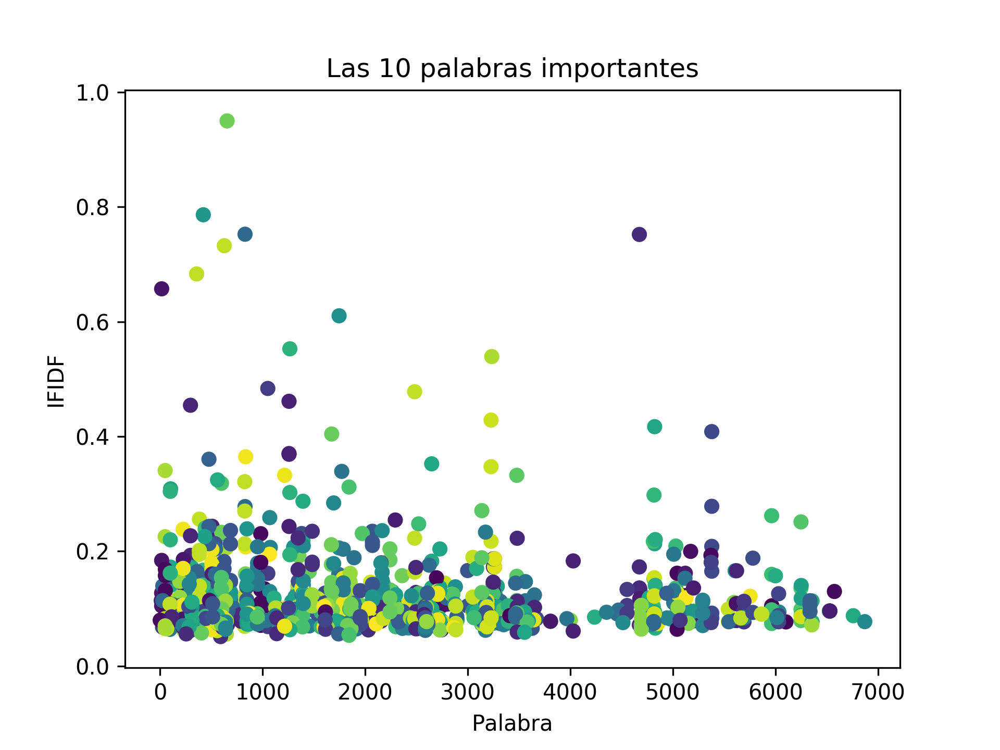

### Requisitos

Tener instalado Python 3.7 (o superiores), si se utiliza windows, entonces la versión de Python instalada debe ser para 32 bits.

### Proceso de instalación

<ol>
    <li>
Descargar los archivos de esta carpeta.
    
</li>
    <li>
Instalar las librerías de python <strong>"numpy"</strong>, <strong>"pandas"</strong>, <strong>"sklearn"</strong>, <strong>"nltk"</strong>, <strong>"random"</strong>, <strong>"json"</strong>, <strong>"seaborn"</strong> y <strong>"unicodedata"</strong>.
    
</li>
    <li>
Instalar las librerías NLTK adicionales, a través de las sentencias:
        <ul>
            <li>
nltk.download(<strong>'punkt'</strong>)
            
</li>
            <li>
nltk.download(<strong>'stopwords'</strong>)
            
</li>
        </ul>
    
</li>
    <li>
Ejecutar el archivo <strong>"v3_principal.py"</strong> de la siguiente forma:
        <ul>
            <li>
"terminal&gt; python3 nombreDelArchivo.py"
            
</li>
        </ul>
    
</li>
</ol>

### Descripción

Esta práctica proyecto el resultado de dos productos, como se observa en las siguientes imagenes. Esto, basándose en la variable <strong>VT</strong> resultante de la reducción de dimensionalidad del conjunto de datos recogidos por un análisis previo de los párrafos revisados.

Asi mismo, las siguientes imagenes, exponen proyecciones correspondientes a diez palabras más representativas, adquiridas tras la reducción de dimensionalidad de los datos analizados en un proceso previo.

En donde, con base en el último diagrama de dispersión referente al valor <strong>TF-IDF</strong> de las palabras analizadas y los autores de los párrafos utilizados para revisar a estas palabras, se observa que, pese a de existir palabras únicas no compartidas por la mayoría de los autores de los párrafos, muchos de los valores <strong>IFIDF</strong> calculados, tiende a cero. No obstante, de forma similar con la imagen <strong> "Las 10 palabras importantes"</strong> cuyos valores se han agrupado por palabra, se aprecian palabras con valores altos de <strong>TF-IDF</strong>. Por lo tanto, a pesar de no ser datos precisos para procesos de entrenamiento, muestran evidencian diferencias plausibles entre los autores, de forma que, bajo otra perceptiva se considera posible el obtener de mejores resultados.

*******
## Créditos

Autor: *Jorge Luis Jácome Domínguez*

######  Otros medios < [Linkedin](https://www.linkedin.com/in/jorge-luis-j%C3%A1come-dom%C3%ADnguez-44294a91/) - [Dibujando](https://dibujando.net/soragefroren) - [Facebook](https://www.facebook.com/SoraGefroren) - [Youtube](https://www.youtube.com/c/SoraGefroren) >